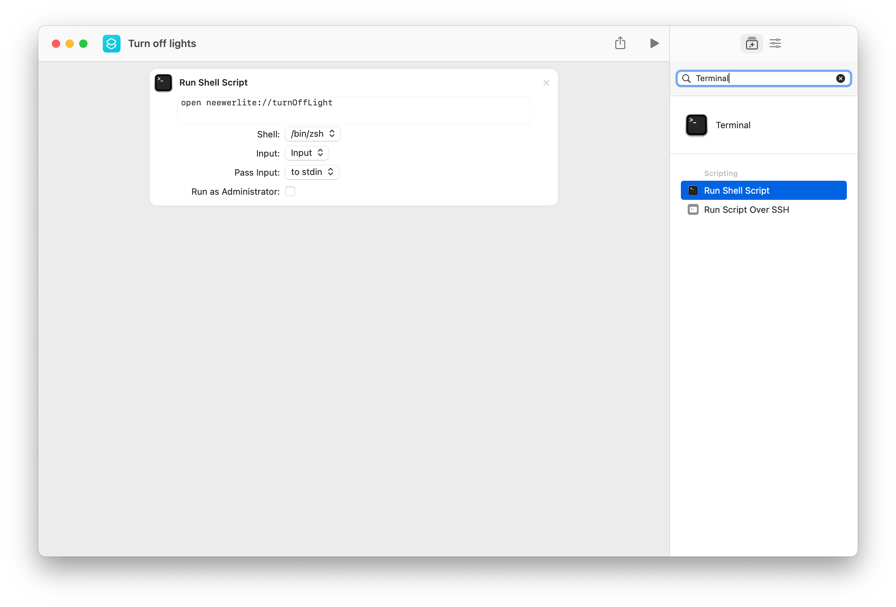
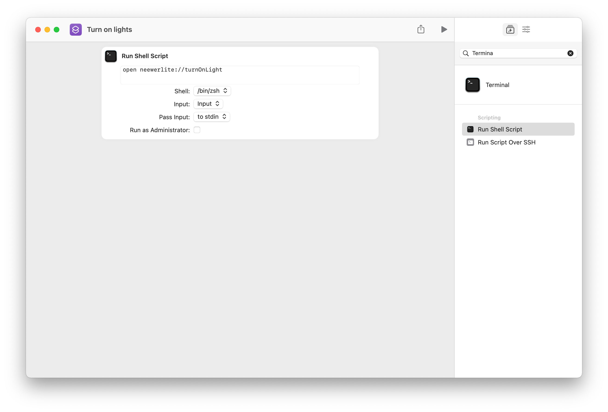

# Integrate NeewerLite with macOS shortcut

* Open shortcuts.app
* Add a new shortcut
* Drag in an action "Termnial -> Run Shell Script"
* Add name "Turn on lights"
* Input the following script in the text field and save

```zsh
open neewerlite://turnOnLight
```

<p>

</p>


<p>

</p>

