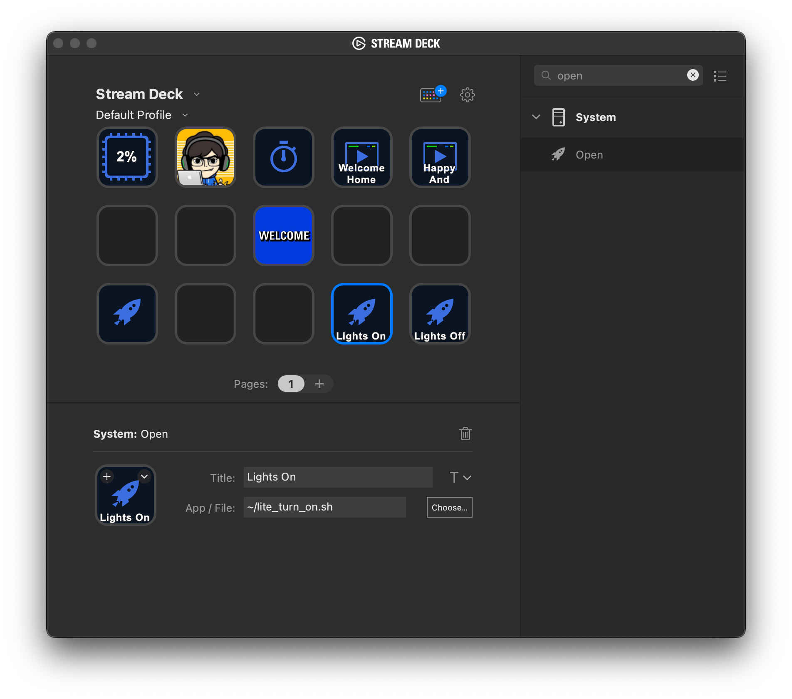

# Integrate NeewerLite with StreamDeck

Open NeewerLite.app, make sure it is running.

## Download and save scripts

Download and save these scripts into your home folder: 

* [lite_turn_off.sh](./lite_turn_off.sh) 
* [lite_turn_on.sh](./lite_turn_on.sh) 
* [lite_scan.sh](./lite_scan.sh) 

## Add exectuabled permission

Open "Terminal.app" run the following command lines:

```bash
chmod +x ~/lite_turn_on.sh
chmod +x ~/lite_turn_off.sh
chmod +x ~/lite_scan.sh
```

## Add 3 "Open" buttons in StreamDeck

<p>

</p>


* For the 1st button click "Choose" and select ```lite_turn_on.sh``` and give a name "Turn On".
* For the 2nd button click "Choose" and select ```lite_turn_off.sh``` and give a name "Turn Off".
* For the 3rd button click "Choose" and select ```lite_scan.sh``` and give a name "Scan Lights".

