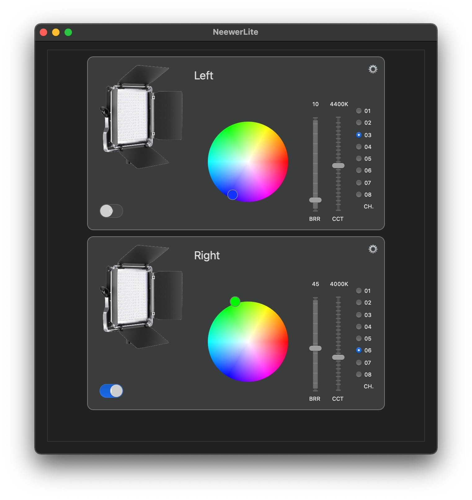

<p align="center">
<a  href="https://github.com/keefo/NeewerLite">
    
</a>
</p>

<h1 align="center">NeewerLite</h1>

[](https://travis-ci.com/github/keefo/NeewerLite)

# About The Project

NeewerLite is an un-official Neewer LED light control app for macOS.

[Neewer](https://neewer.com/) produces some very popupler high-CRI LED lights for photography industry. They provides android and iOS app to control those lights through Bluetooth. However, they don't provides any means to control lights from a PC or Mac.

This project is meant to provide such app so you could control bluetooth-enabled Neewer LED light from you Mac.

You could integrate the light control in your [Elgato Stream Deck](https://www.elgato.com/en/gaming/stream-deck) through this app. 

Here is a video I made to demo the scene: 

<p>
<a align="left" href="https://youtu.be/pbNi6HZTDEc">
	
</a>

</p>

# Features

- Power On/Off control
- Brightness control
- Correlated color temperature control
- RGB color control
- Schema support

## Schema Usage

Open the app and let it scans all Neewer lights through Bluetooth. Once it finds lights. Then you could use command to switch On/Off lights.

Use this command to turn on all lights:

```bash
open neewerlite://turnOnLight
```

Use this command to turn off all lights:
```bash
open neewerlite://turnOffLight
```

Use this command to toggle all lights:
```bash
open neewerlite://toggleLight
```
## Voice Control Interaction

You could integrate these commands into Voice Control. 

Open “System Preferences” -> “Accessibility” -> “Voice Control” -> “Commands”, Click the “+” button to create a new command, give a name to your new command such as “Meow” and choose “Any Application” then choose perform “Open URL”.  Type in “neewerlite://toggleLight” for example. 

Now, when you say “Meow” voice control will switch on/off your LED lights.

# TO DO LIST

If you find a way to implement these features, feel free to create a pull request.

- [ ] Add scene support
- [ ] Lights sync with music
- [ ] Add pictures for other Neewer LED lights

# License

Follow NeewerLite, the code and examples of this project is released under MIT License.

