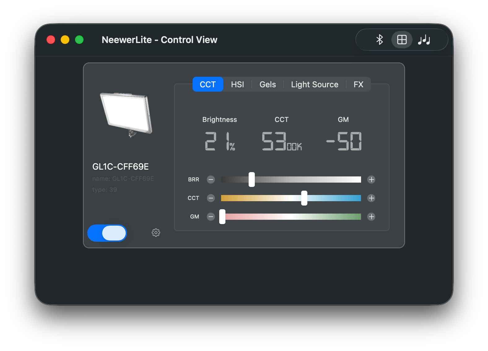
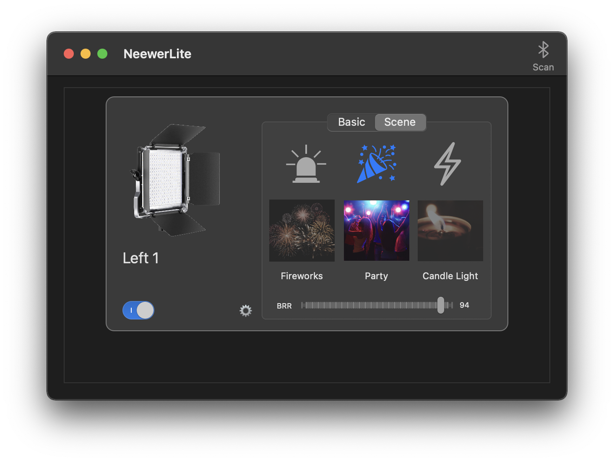

<p align="center">
<a  href="https://github.com/keefo/NeewerLite">
    
</a>
</p>

<h1 align="center">NeewerLite</h1>

# About The Project

[](https://travis-ci.com/github/keefo/NeewerLite)

NeewerLite is an un-official Neewer LED light control app for macOS.

[Neewer](https://neewer.com/) produces popular high-CRI LED lights for media industry. They provides android and [iOS app](https://apps.apple.com/us/app/neewer/id1455948340) to control their lights through Bluetooth. However, they don't provides any means to control lights from a PC or Mac.

This project creates a macOS app so you could control bluetooth-enabled Neewer LED lights from you Mac.

You could integrate the light control in your [Elgato Stream Deck](https://www.elgato.com/en/gaming/stream-deck) through this app. 

Here is a video I made to demo the scene: 

<p>
<a align="left" href="https://youtu.be/pbNi6HZTDEc">
	
</a>


</p>

# Features

- Power On/Off control
- Brightness control
- Correlated color temperature control
- RGB color control
- Scene control
- Script support
- Sync RGB lights with music

## Script Usage

Open the app and let it scans all Neewer lights through Bluetooth. Once it finds lights. Then you could use command to switch On/Off lights.

Turn on all lights:

```bash
open neewerlite://turnOnLight
```

Turn off all lights:
```bash
open neewerlite://turnOffLight
```

Toggle all lights:
```bash
open neewerlite://toggleLight
```

Scan all lights:
```bash
open neewerlite://scanLight
```

### How to use script to integrate with Elgato Stream Deck?

Read this [Integrate with Elgato Stream Deck](./Docs/Integrate-with-streamdeck.md)

### How to use script to integrate with macOS Shortcuts?

Read this [Integrate with Shortcuts](./Docs/Integrate-with-shortcut.md)

### Voice Control Interaction

You could integrate these commands into Voice Control. 

Open “System Preferences” -> “Accessibility” -> “Voice Control” -> “Commands”, Click the “+” button to create a new command, give a name to your new command such as “Meow” and choose “Any Application” then choose perform “Open URL”.  Type in “neewerlite://toggleLight” for example. 

Now, when you say “Meow” voice control will switch on/off your LED lights.

# Tested Lights

* [Neewer 660 RGB Led Light](https://neewer.com/products/neewer-led-light-10096807)
* [Neewer 480 RGB Led Light](https://neewer.com/collections/rgb-led-panel-light/products/neewer-led-light-10096594)

# TO DO LIST

If you find a way to implement these features, feel free to create a pull request.

- [ ] Test more Neewer LED lights
- [ ] Add support for other Neewer LED lights

# License

Follow NeewerLite, the code and examples of this project is released under MIT License.

